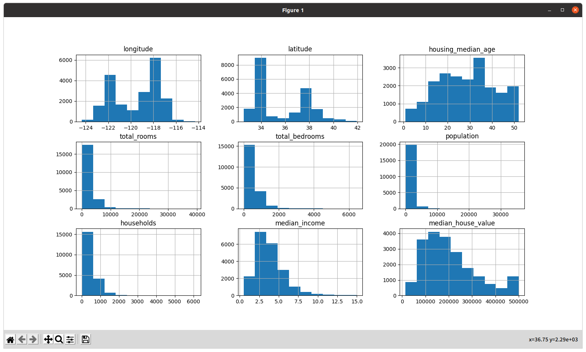

[TOC]

# 「scikit-learn,Keras,TensoFlowによる実践機械学習」のメモ

## docker-compose環境の構築(不要かも)

docker-composeを使用した環境が用意されているようなので、これを活用する。
現環境にはdockerはインストールされているが、docker-composeはインストールされていなかったので[Docker Compose のインストール](https://docs.docker.jp/compose/install.html)を参考にインストールする。
現時点(2021/01/13)での最新版が1.27.4だった。

```sh
sudo curl -L \
  https://github.com/docker/compose/releases/download/1.27.4/docker-compose-$(uname)-$(uname -i) \
  -o /usr/local/bin/docker-compose
sudo chmod +x /usr/local/bin/docker-compose
docker-compose --version
```

githubからダウンロード。ここにjupyter notebook環境が含まれる。

```sh
mkdir -p ~/sources
cd sources
git clone https://github.com/ageron/handson-ml2
cd handson-ml2
```

docker-composeでhandson-ml2環境のjupyter notebookを実行

```sh
cd docker
make build # docker-compose build
make run # docker-compose up
```

## 2. エンドツーエンドの機械学習プロジェクト

### 2.2 全体像を掴む

まずは、問題の枠組みを知り、どのように問題を解決するかを決める必要がある。
問題の詳細は本文参照のこと。

* 教師あり学習/教師なし学習/強化学習
  + 今回はラベル付きの訓練データが与えられるので**教師あり学習**
* 分類/回帰/その他
  + 住宅価格の値の予測をするので回帰の問題になる。
    - 複数の特徴量から予測を行うため、**重回帰問題**
    - 住宅価格という一つの値を予測するので**単変量回帰**
    - もし複数の値を予測する場合あ他変量回帰となる
  + もし、住宅価格ではなく価格のカテゴリ(高、中、低)を予測する必要があるなら分類の問題となる
* バッチ学習/オンライン学習
  + 継続的に更新するものではなく、データ量は少ない(メモリに収まる)ので普通のバッチ学習

性能指標に関して、回帰問題では**二乗平方根誤差** (Root Mean Square Error: RMSE) がよく使われる。
大きな誤差に重みをつけて誤差を示すものである。誤差の二乗にすることで大きな誤差に重みをつける。
($l_2$ノルム、ユークリッドノルム)

$$
\textrm{RMSE} (\textbf{X}, h) =
  \sqrt{\frac{1}{m} \sum_{i=1}^{m} (h (\textbf{x}^{(i)}) - y^{(i)})^2 }
$$

RMSEは大きな誤差に重みがつくため、外れ値が多いデータには向いていない。
このような場合は、**平均絶対誤差** (MAE: Mean Absolute Error) を使うほうが良いこともある。
MAEは**平均絶対偏差** (Maen Absolute Diviation) と呼ばれることもある。
($l_1$ノルム、マンハッタンノルム)

$$
\textrm{MAE} (\textbf{X}, h) =
  \frac{1}{m} \sum_{i=1}^{m} \left| h (\textbf{x}^{(i)}) - y^{(i)} \right|
$$


### 2.3 データを手に入れる

#### 2.3.1 ワークスペースを作る

Jupyter Notebookの環境で実行するので、その準備を行う。

本の内容では[anaconda](https://docs.anaconda.com/)や[virtualenv](https://virtualenv.pypa.io/en/latest/)を推奨しているが、ここではPython環境で標準で用意されている[venv](https://docs.python.org/ja/3.8/library/venv.html)を使う。
Pythonのバージョンは[pyenv](https://github.com/pyenv/pyenv)で3.8.7をインストールした。

```
$ python --version
Python 3.8.7
$ which python
/home/saido/.pyenv/shims/python
```

まずは、venvで仮想環境を作成してアクティベートして、必要なパッケージをインストールしていく。

```sh
# venv仮想環境作成
python -m venv venv_handson-ml2
source ./venv_handson-ml2/bin/activate # 仮想環境に入る。抜けるときは "deactivate" と打つ
# 以降、プロンプトに (venv_handson-ml2) が表示される

# 必要パッケージのインストール
python -m pip install -U pip # まずはpipのアップデート
python -m pip install jupyter matplotlib numpy pandas scipy scikit-learn

# IPython kernel をインストール (Jupyter Notebookのバックエンド)
python -m ipykernel install --user --name handson-ml2 --display-name "Python3 (handson-ml2)"
```

Jupyterを起動してみる。

```sh
jupytr notebook
```

上記コマンド実行後、`http://localhost:8888/`にアクセスするとnotebook環境が見える。
ここまでの記述の通りに進めていれば、`venv_handson-ml2`だけが見える環境になっているはず。
ここで、以下のプルダウンリストから先ほど作成したカーネルを選択する。(新規ページが開く)


以下の場所をクリックしてタイトルをHousingに変更する。


入力部分に適当に`print("Hello world!")`と打って実行(▶ボタンを押す)してみると、Hello world!が表示されるはず。


#### 2.3.2 データを手に入れる

本では、Pythonスクリプトで元データを手に入れているが、bashなどの方が親しみやすいのでそのようにする。

なお、今回はなるべくJupyterを使わず素のPythonで実行しようと思っている。
これは依存性と再利用性を意識しているのと、GUIをポチポチするのが性に合わないためである。
Gppgle Colablatoryなどを使用する予定がある場合はJupyterで実行するのが良いと思う。

以下コマンドでデータをダウンロードする。

```sh
DOWNLOAD_ROOT="https://raw.githubusercontent.com/ageron/handson-ml2/master/"
HOUSING_PATH="datasets/housing"
HOUSING_URL="${DOWNLOAD_ROOT}${HOUSING_PATH}/housing.tgz"

mkdir -p $HOUSING_PATH
wget $HOUSING_URL -O "${HOUSING_PATH}/housing.tgz"
tar xvf "${HOUSING_PATH}/housing.tgz" -C $HOUSING_PATH
```

#### 2.3.2 データを見てみる

pandasで読んでみる。

```python
import pandas as pd

csv_path = 'datasets/housing/housing.csv'
df = pd.read_csv(csv_path)

# 最初の5行を確認
print(df.head())
#    longitude  latitude  housing_median_age  total_rooms  ...  households  median_income  median_house_value  ocean_proximity
# 0    -122.23     37.88                41.0        880.0  ...       126.0         8.3252            452600.0         NEAR BAY
# 1    -122.22     37.86                21.0       7099.0  ...      1138.0         8.3014            358500.0         NEAR BAY
# 2    -122.24     37.85                52.0       1467.0  ...       177.0         7.2574            352100.0         NEAR BAY
# 3    -122.25     37.85                52.0       1274.0  ...       219.0         5.6431            341300.0         NEAR BAY
# 4    -122.25     37.85                52.0       1627.0  ...       259.0         3.8462            342200.0         NEAR BAY
# [5 rows x 10 columns]

# 情報を表示(総行数や属性、nullでない数など)
print(df.info())
# <class 'pandas.core.frame.DataFrame'>
# RangeIndex: 20640 entries, 0 to 20639
# Data columns (total 10 columns):
#  #   Column              Non-Null Count  Dtype  
# ---  ------              --------------  -----  
#  0   longitude           20640 non-null  float64
#  1   latitude            20640 non-null  float64
#  2   housing_median_age  20640 non-null  float64
#  3   total_rooms         20640 non-null  float64
#  4   total_bedrooms      20433 non-null  float64
#  5   population          20640 non-null  float64
#  6   households          20640 non-null  float64
#  7   median_income       20640 non-null  float64
#  8   median_house_value  20640 non-null  float64
#  9   ocean_proximity     20640 non-null  object 
# dtypes: float64(9), object(1)
# memory usage: 1.6+ MB
# None

# ocean_proximity なるものがオブジェクトだと言っているので見てみる。
print(df['ocean_proximity'].value_counts())
# <1H OCEAN     9136
# INLAND        6551
# NEAR OCEAN    2658
# NEAR BAY      2290
# ISLAND           5
# Name: ocean_proximity, dtype: int64

# 統計情報
print(df.describe())
# Name: ocean_proximity, dtype: int64
#           longitude      latitude  housing_median_age  ...    households  median_income  median_house_value
# count  20640.000000  20640.000000        20640.000000  ...  20640.000000   20640.000000        20640.000000
# mean    -119.569704     35.631861           28.639486  ...    499.539680       3.870671       206855.816909
# std        2.003532      2.135952           12.585558  ...    382.329753       1.899822       115395.615874
# min     -124.350000     32.540000            1.000000  ...      1.000000       0.499900        14999.000000
# 25%     -121.800000     33.930000           18.000000  ...    280.000000       2.563400       119600.000000
# 50%     -118.490000     34.260000           29.000000  ...    409.000000       3.534800       179700.000000
# 75%     -118.010000     37.710000           37.000000  ...    605.000000       4.743250       264725.000000
# max     -114.310000     41.950000           52.000000  ...   6082.000000      15.000100       500001.000000
# [8 rows x 9 columns]

# グラフ表示
import matplotlib.pyplot as plt
housing.hist() # matplotlibに依存
plt.show()
```

`hist`メソッドでの表示は以下のようになる。



