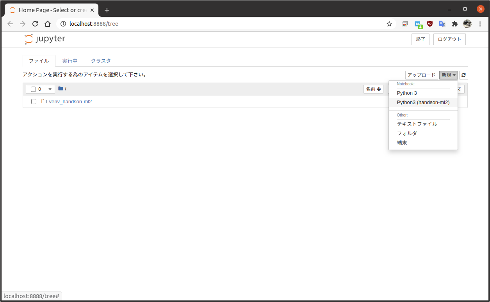
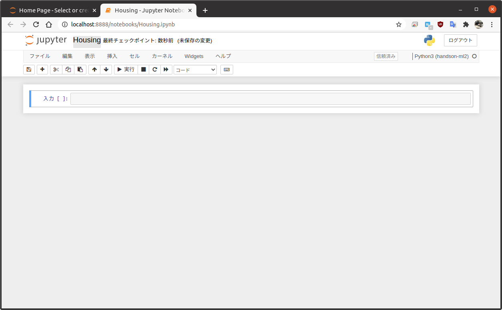

[TOC]

# 「scikit-learn,Keras,TensoFlowによる実践機械学習」のメモ

## docker-compose環境の構築(不要かも)

docker-composeを使用した環境が用意されているようなので、これを活用する。
現環境にはdockerはインストールされているが、docker-composeはインストールされていなかったので[Docker Compose のインストール](https://docs.docker.jp/compose/install.html)を参考にインストールする。
現時点(2021/01/13)での最新版が1.27.4だった。

```sh
sudo curl -L \
  https://github.com/docker/compose/releases/download/1.27.4/docker-compose-$(uname)-$(uname -i) \
  -o /usr/local/bin/docker-compose
sudo chmod +x /usr/local/bin/docker-compose
docker-compose --version
```

githubからダウンロード。ここにjupyter notebook環境が含まれる。

```sh
mkdir -p ~/sources
cd sources
git clone https://github.com/ageron/handson-ml2
cd handson-ml2
```

docker-composeでhandson-ml2環境のjupyter notebookを実行

```sh
cd docker
make build # docker-compose build
make run # docker-compose up
```

## 2. エンドツーエンドの機械学習プロジェクト

### 2.2 全体像を掴む

まずは、問題の枠組みを知り、どのように問題を解決するかを決める必要がある。
問題の詳細は本文参照のこと。

* 教師あり学習/教師なし学習/強化学習
  + 今回はラベル付きの訓練データが与えられるので**教師あり学習**
* 分類/回帰/その他
  + 住宅価格の値の予測をするので回帰の問題になる。
    - 複数の特徴量から予測を行うため、**重回帰問題**
    - 住宅価格という一つの値を予測するので**単変量回帰**
    - もし複数の値を予測する場合あ他変量回帰となる
  + もし、住宅価格ではなく価格のカテゴリ(高、中、低)を予測する必要があるなら分類の問題となる
* バッチ学習/オンライン学習
  + 継続的に更新するものではなく、データ量は少ない(メモリに収まる)ので普通のバッチ学習

性能指標に関して、回帰問題では**二乗平方根誤差** (Root Mean Square Error: RMSE) がよく使われる。
大きな誤差に重みをつけて誤差を示すものである。誤差の二乗にすることで大きな誤差に重みをつける。
($l_2$ノルム、ユークリッドノルム)

$$
\textrm{RMSE} (\textbf{X}, h) =
  \sqrt{\frac{1}{m} \sum_{i=1}^{m} (h (\textbf{x}^{(i)}) - y^{(i)})^2 }
$$

RMSEは大きな誤差に重みがつくため、外れ値が多いデータには向いていない。
このような場合は、**平均絶対誤差** (MAE: Mean Absolute Error) を使うほうが良いこともある。
MAEは**平均絶対偏差** (Maen Absolute Diviation) と呼ばれることもある。
($l_1$ノルム、マンハッタンノルム)

$$
\textrm{MAE} (\textbf{X}, h) =
  \frac{1}{m} \sum_{i=1}^{m} \left| h (\textbf{x}^{(i)}) - y^{(i)} \right|
$$


### 2.3 データを手に入れる

#### 2.3.1 ワークスペースを作る

Jupyter Notebookの環境で実行するので、その準備を行う。

本の内容では[anaconda](https://docs.anaconda.com/)や[virtualenv](https://virtualenv.pypa.io/en/latest/)を推奨しているが、ここではPython環境で標準で用意されている[venv](https://docs.python.org/ja/3.8/library/venv.html)を使う。
Pythonのバージョンは[pyenv](https://github.com/pyenv/pyenv)で3.8.7をインストールした。

```
$ python --version
Python 3.8.7
$ which python
/home/saido/.pyenv/shims/python
```

まずは、venvで仮想環境を作成してアクティベートして、必要なパッケージをインストールしていく。

```sh
# venv仮想環境作成
python -m venv venv_handson-ml2
source ./venv_handson-ml2/bin/activate # 仮想環境に入る。抜けるときは "deactivate" と打つ
# 以降、プロンプトに (venv_handson-ml2) が表示される

# 必要パッケージのインストール
python -m pip install -U pip # まずはpipのアップデート
python -m pip install jupyter matplotlib numpy pandas scipy scikit-learn

# IPython kernel をインストール (Jupyter Notebookのバックエンド)
python -m ipykernel install --user --name handson-ml2 --display-name "Python3 (handson-ml2)"
```

Jupyterを起動してみる。

```sh
jupytr notebook
```

上記コマンド実行後、`http://localhost:8888/`にアクセスするとnotebook環境が見える。
ここまでの記述の通りに進めていれば、`venv_handson-ml2`だけが見える環境になっているはず。
ここで、以下のプルダウンリストから先ほど作成したカーネルを選択する。(新規ページが開く)



以下の場所をクリックしてタイトルをHousingに変更する。



入力部分に適当に`print("Hello world!")`と打って実行(▶ボタンを押す)してみると、Hello world!が表示されるはず。

