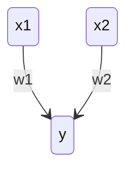
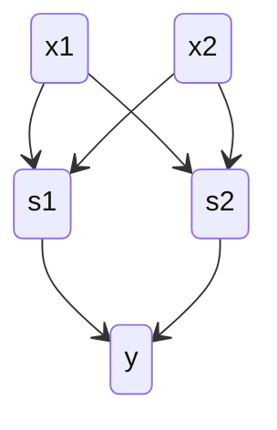
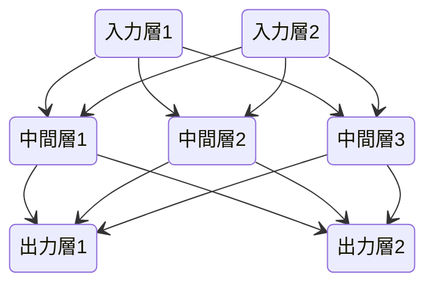
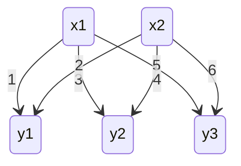

[TOC]

# ゼロから作るDeep Learningの読書メモ

## パーセプトロン

出力$y$は重み$w_{i}$と入力$x_{i}$、バイアス$b$から生成する。バイアスは固定値。

$$
y = \left \{
    \begin{array}{l}
        0 \quad (b + w_{1}x_{1} + w_{2}x_{2} \leqq 0) \\
        1 \quad (b + w_{1}x_{1} + w_{2}x_{2} > 0 )
    \end{array}
\right.
$$

基本的な構造はこんな感じ。(`graph`では線が微妙で、横に書きたかったが`stateDiagram-v2`では縦にしか書けない)



このパーセプトロン単体は、線形であるANDやORを実現できるが非線形なXORは実現できない。  
ただし、簡単なパーセプトロンを重ねることでXORのような非線形なものを実現することができる。



## ニューラルネットワーク

ニューラルネットワークは、以下のように多層のパーセプトロンと同じつながり方をしている。



パーセプトロンのところで出てきた式は、パーセプトロンにおける活性化関数と呼ぶ。
このパーセプトロンの活性化関数はステップ関数と呼ばれる(ある時点から0→1に切り替わる)。
活性化関数にステップ関数ではなく、連続的に変化するような関数などを用いることでニューラルネットワークっぽくなっていく。

活性化関数はだいたい$h(x)$で表される。


### シグモイド関数

ニューラルネットワークの世界でよく使われる基本的な活性化関数は、以下のようなシグモイド関数がある。

$$
h(x) = \frac {1} {1 + e^{-x}}
$$

多層のパーセプトロンもニューラルネットワークも層を重ねることで複雑な演算を実現するが、この性質は活性化関数が非線形なことが重要。
線形な関数をいくら重ねても線形な結果しか得られないためである。

### ReLU関数

ReLU (Rectified Linear Unit) は以下の数式で表される。0より小さい部分は0になるだけの活性化関数。

$$
h(x) = \left \{
    \begin{array}{l}
        x \quad (x > 0) \\
        0 \quad (x \leqq 0)
    \end{array}
\right.
$$

### 行列の内積

ニューラルネットワーウの計算を行う場合、行列演算で行うと楽に表現できるし、Pythonなどでの計算が楽に実装できる。
例えば以下のようなネットワークを計算する場合を想定する。



この場合、以下のように計算することにすると、表現が簡単になり嬉しい。

$$
\left ( \begin{array}{r}
    x_{1} & x_{2}
\end{array} \right )

\times

\left ( \begin{array}{rrr}
    1 & 3 & 5 \\
    2 & 4 & 6
\end{array} \right )

=

\left ( \begin{array}{rrr}
    y_{1} & y_{2} & y_{3}
\end{array} \right )
$$

ただし、行列演算を行うので次元の一致に関しては注意を払う必要がある。
バイアス項を導入する場合は、単に$\left ( \begin{array}{rrr} b_{1} & b_{2} & b_{3} \end{array} \right )$を結果に加算すれば良い。

### 出力層(恒等関数とソフトマックス関数)

恒等関数は、そのまま出力する。
ソフトマックス関数は以下のような式で表される。

$$
y_{k} = \frac {exp(a_{k})} {\sum_{i=1}^{n} exp(a_{i})}
$$

恒等関数(のようなもの)は、連続値を予測するような問題(回帰問題)で使われる。連続値を予測する場合は出力ノードが1つのみで、シグモイド関数のような出力をするのが都合が良い。
一方、ソフトマックス関数は、複数の出力のうちどれかを選択するような問題(分類問題)で使われる。ソフトマックス関数の出力は合計が1になるので、これを分類結果の確率として扱えうようにすれば都合が良い。

ただし、ソフトマックス関数をプログラミングで実装する場合、分母と分子の$exp(x)$の値が大きくなりすぎて計算できない場合が発生しやすい。(たとえばPythonにおいて$e^{1000}$はオーバーフローして`inf`を返す)
このような状況を防止するために、以下の式変形ができることを利用する。

$$
\begin{aligned}
y_{k} &= \frac {exp(a_{k})} {\sum_{i=1}^n exp(a_{i})} \\
&= \frac {C exp(a_{k})} {C \sum_{i=1}^n exp(a_{i})} \\
&= \frac {exp(a_{k} + logC)} {\sum_{i=1}^n exp(a_{i} + logC)} \\
&= \frac {exp(a_{k} + C')} {\sum_{i=1}^n exp(a_{i} + C')}
\end{aligned}
$$

というように、入力$a_{k}$に対して適当な定数を加算(減算)しても結果は変わらない。
このため、入力の最大値で減算することで$a_{k}$を小さな値に正規化するようにしてオーバーフローすることを防ぐ。


### バッチ処理

手書きの数字を推定するためのMNISTデータセットを例にする。
MNISTデータセットは$28 \times 28 = 784$個のデータを持つ。グレースケールなので1チャネル分だが、カラーの場合はRGBなどの3チャネル分のデータを持つ。
このデータを10種類の数字に当てはめるので、ニューラルネットワークとしては10個の出力を持つことになる。
今回は隠れ層として一つ目に50個、二つ目に100個のニューロンを持つことにする。
このとき、計算対象の行列の形は以下のようになる。

```
 X    W1     W2     W3       Y
784 784*50 50*100 100*10 --> 10
```

上記の入力Xを複数まとめて100個入力する場合、以下のようになる。

```
   X      W1     W2     W3         Y
100*784 784*50 50*100 100*10 --> 100*10
```

このような入力方法をバッチ処理と呼び、ソフトウェアなどでの計算を高速にするために必要になる。
これは多くのソフトウェアライブラリが大きな配列の計算に最適化されているためである。
GPUなどはそもそも複数の計算を並列で処理することを前提にしているので、細かい単位で計算するとオーバーヘッド(処理しない無駄な並列部分)が大きくなり、バッチ処理を行うと相対的にオーバーヘッドが小さくなるなどの背景がある。CPUも同様にマルチスレッド、マルチプロセスの恩恵などで、バッチ処理すると高速になるはず。

