[TOC]

# ゼロから作るDeep Learningの読書メモ

このメモではPython依存の部分はあまり触れず、理論的な内容を追うことにする。

## パーセプトロン

出力$y$は重み$w_{i}$と入力$x_{i}$、バイアス$b$から生成する。バイアスは固定値。

$$
y = \left \{
    \begin{array}{l}
        0 \quad (b + w_{1}x_{1} + w_{2}x_{2} \leqq 0) \\
        1 \quad (b + w_{1}x_{1} + w_{2}x_{2} > 0 )
    \end{array}
\right.
$$

基本的な構造はこんな感じ。(`graph`では線が微妙で、横に書きたかったが`stateDiagram-v2`では縦にしか書けない)

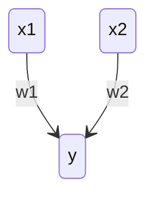

このパーセプトロン単体は、線形であるANDやORを実現できるが非線形なXORは実現できない。  
ただし、簡単なパーセプトロンを重ねることでXORのような非線形なものを実現することができる。

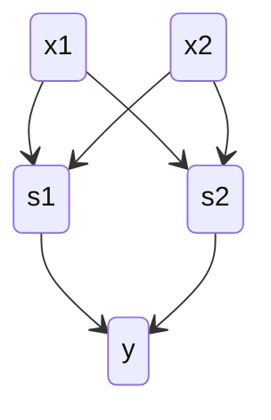

## ニューラルネットワーク

ニューラルネットワークは、以下のように多層のパーセプトロンと同じつながり方をしている。

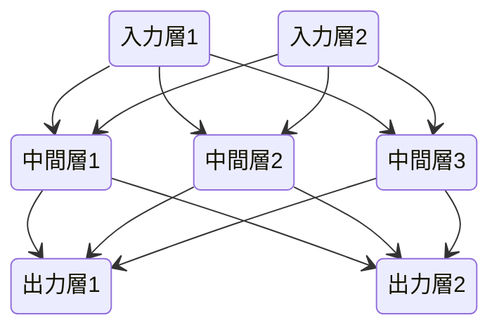

パーセプトロンのところで出てきた式は、パーセプトロンにおける活性化関数と呼ぶ。
このパーセプトロンの活性化関数はステップ関数と呼ばれる(ある時点から0→1に切り替わる)。
活性化関数にステップ関数ではなく、連続的に変化するような関数などを用いることでニューラルネットワークっぽくなっていく。

活性化関数はだいたい$h(x)$で表される。


### シグモイド関数

ニューラルネットワークの世界でよく使われる基本的な活性化関数は、以下のようなシグモイド関数がある。

$$
h(x) = \frac {1} {1 + e^{-x}}
$$

多層のパーセプトロンもニューラルネットワークも層を重ねることで複雑な演算を実現するが、この性質は活性化関数が非線形なことが重要。
線形な関数をいくら重ねても線形な結果しか得られないためである。

### ReLU関数

ReLU (Rectified Linear Unit) は以下の数式で表される。0より小さい部分は0になるだけの活性化関数。

$$
h(x) = \left \{
    \begin{array}{l}
        x \quad (x > 0) \\
        0 \quad (x \leqq 0)
    \end{array}
\right.
$$

### 行列の内積

ニューラルネットワーウの計算を行う場合、行列演算で行うと楽に表現できるし、Pythonなどでの計算が楽に実装できる。
例えば以下のようなネットワークを計算する場合を想定する。

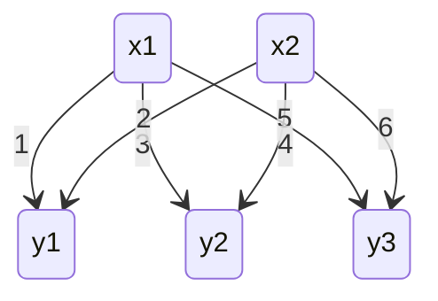

この場合、以下のように計算することにすると、表現が簡単になり嬉しい。

$$
\left ( \begin{array}{r}
    x_{1} & x_{2}
\end{array} \right )

\times

\left ( \begin{array}{rrr}
    1 & 3 & 5 \\
    2 & 4 & 6
\end{array} \right )

=

\left ( \begin{array}{rrr}
    y_{1} & y_{2} & y_{3}
\end{array} \right )
$$

ただし、行列演算を行うので次元の一致に関しては注意を払う必要がある。
バイアス項を導入する場合は、単に$\left ( \begin{array}{rrr} b_{1} & b_{2} & b_{3} \end{array} \right )$を結果に加算すれば良い。

### 出力層(恒等関数とソフトマックス関数)

恒等関数は、そのまま出力する。
ソフトマックス関数は以下のような式で表される。

$$
y_{k} = \frac {exp(a_{k})} {\sum_{i=1}^{n} exp(a_{i})}
$$

恒等関数(のようなもの)は、連続値を予測するような問題(回帰問題)で使われる。連続値を予測する場合は出力ノードが1つのみで、シグモイド関数のような出力をするのが都合が良い。
一方、ソフトマックス関数は、複数の出力のうちどれかを選択するような問題(分類問題)で使われる。ソフトマックス関数の出力は合計が1になるので、これを分類結果の確率として扱えうようにすれば都合が良い。

ただし、ソフトマックス関数をプログラミングで実装する場合、分母と分子の$exp(x)$の値が大きくなりすぎて計算できない場合が発生しやすい。(たとえばPythonにおいて$e^{1000}$はオーバーフローして`inf`を返す)
このような状況を防止するために、以下の式変形ができることを利用する。

$$
\begin{aligned}
y_{k} &= \frac {exp(a_{k})} {\sum_{i=1}^n exp(a_{i})} \\
&= \frac {C exp(a_{k})} {C \sum_{i=1}^n exp(a_{i})} \\
&= \frac {exp(a_{k} + logC)} {\sum_{i=1}^n exp(a_{i} + logC)} \\
&= \frac {exp(a_{k} + C')} {\sum_{i=1}^n exp(a_{i} + C')}
\end{aligned}
$$

というように、入力$a_{k}$に対して適当な定数を加算(減算)しても結果は変わらない。
このため、入力の最大値で減算することで$a_{k}$を小さな値に正規化するようにしてオーバーフローすることを防ぐ。


### バッチ処理

手書きの数字を推定するためのMNISTデータセットを例にする。
MNISTデータセットは$28 \times 28 = 784$個のデータを持つ。グレースケールなので1チャネル分だが、カラーの場合はRGBなどの3チャネル分のデータを持つ。
このデータを10種類の数字に当てはめるので、ニューラルネットワークとしては10個の出力を持つことになる。
今回は隠れ層として一つ目に50個、二つ目に100個のニューロンを持つことにする。
このとき、計算対象の行列の形は以下のようになる。

```
 X    W1     W2     W3       Y
784 784*50 50*100 100*10 --> 10
```

上記の入力Xを複数まとめて100個入力する場合、以下のようになる。

```
   X      W1     W2     W3         Y
100*784 784*50 50*100 100*10 --> 100*10
```

このような入力方法をバッチ処理と呼び、ソフトウェアなどでの計算を高速にするために必要になる。
これは多くのソフトウェアライブラリが大きな配列の計算に最適化されているためである。
GPUなどはそもそも複数の計算を並列で処理することを前提にしているので、細かい単位で計算するとオーバーヘッド(処理しない無駄な並列部分)が大きくなり、バッチ処理を行うと相対的にオーバーヘッドが小さくなるなどの背景がある。CPUも同様にマルチスレッド、マルチプロセスの恩恵などで、バッチ処理すると高速になるはず。

## ニューラルネットワークの学習(トレーニング)

画像を認識するには、以下のようなアプローチがある。

1. 人が画像を認識するアルゴリズムを作る  
    この手法は時間がかかりすぎる
2. 機械学習(上手に特徴量を抽出する必要がある)
    1. 特徴量の抽出(SIFT/SURF/HOGなど人が考えた特徴量) ← ここは手動
    2. 特徴量を学習可能な識別機(SVM/KNNなど)で識別 ← ここは自動
3. ニューラルネットワーク(ディープラーニング;深層学習)
    + 特徴量の抽出も、識別(推論)もまとめて学習できる
    + 必要な出力が得られるまで重みなどのパラメータの調整をがんばる

学習に使用するデータは訓練データ(教師データとかトレーニングデータとも呼ぶ)とテストデータに分けるのが一般的。これは訓練に使用するデータだけに特化した状態になっているか確認するためである。
訓練データに特化した状態では訓練データ以外を正しく認識できない。この状態のことを過学習(overfitting)状態と呼ぶ。逆に訓練データ以外でも正しく認識できる能力のことを汎化能力と呼ぶ。

### 損失関数

ニューラルネットワークの学習で用いられる指標は、損失関数(loss function)により求める。
損失関数は一般的に2乗和誤差や交差エントロピー誤差が用いられる。

#### 2乗和誤差

2乗和誤差(mean squared error)は次の数式で表される。

$$
E = \frac{1}{2} \sum_{k}(y_k - t_k)^2
$$

$y_k$がニューラルネットワークの出力で$t_k$が教師データ(訓練データ)で、$k$は次元数である。
例えばMNISTの場合、以下のようにそれぞれ10個のデータになる。これはソフトマックスの出力で、それぞれが10個の数値である確率を表している。教師データはもちろん1が一つだけで残り9個は0のデータになる。

```python
y = [0.1, 0.05, 0.6, 0.0, 0.05, 0.1, 0.0, 0.1, 0.0, 0.0]
t = [0,   0,    1,   0,   0,    0,   0,   0,   0,   0  ]
```

上記の例では、0オリジンで正解が"2"であるため、`t[1]`が1になっている。この`t[1]`のことを正解ラベルという。


#### 交差エントロピー誤差

交差エントロピー誤差(cross entropy error)は次の数式で表される。

$$
E = - \sum_{k}(t_k \, \mathrm{log_e} \, y_k)
$$

この場合の$y_k$と$t_k$は先ほどと同様にニューラルネットワークの出力と教師データ(訓練データ)である。
$t_k$は一つだけ1になるone-hot表現であるため、正解ラベルの自然対数を計算するだけになる。
例えば先ほどと同じ以下のデータだった場合、$E = - \mathrm{log_e} \, 0.6 = 0.51$などとなる。

```python
y = [0.1, 0.05, 0.6, 0.0, 0.05, 0.1, 0.0, 0.1, 0.0, 0.0]
t = [0,   0,    1,   0,   0,    0,   0,   0,   0,   0  ]
```

実際の計算では、$y_k$の値が0になることがありこの場合$\mathrm{log_e} \, 0 = - \infty$となり以降の計算ができなくなってしまうので、以下のように微小値$1 \times 10^{-7}$(`1e-7`)を足して計算する。

$$
E = - \sum_{k}(t_k \, \mathrm{log_e} \, (y_k + 1 \times 10^{-7}))
$$


#### ミニバッチ

訓練データはたくさんあるので、その訓練データすべての損失関数の和を求めることで訓練データ全体の指標とする。ただし、そのままでは訓練データの数に比例して値が大きくなるのでデータ数で割ることで一つの訓練データの損失関数の平均を指標とする。これを「訓練データ数で正規化する」という。
交差エントロピー誤差の場合の数式は以下のようになる。こうすることでデータ数が増えても対応できるようにする。

$$
E = - \frac{1}{N} \sum_{n} \sum_{k}(t_{nk} \, \mathrm{log_e} \, y_{nk})
$$

また、訓練データは通常膨大で、すべてをの損失関数を計算することは現実的ではないのでいくつかを選び出して全体の近似を行う。これを「ミニバッチ」と呼び、このミニバッチごとに学習を行う。
また、学習ごとにランダムにデータを選び出すことで精度を保つようにする。


#### 損失関数について(なぜ損失関数なのか？)

詳細は後述されるが、ニューラルネットワークの学習では損失関数の微分値によって重みなどのパラメータをどちらへ変化させればよいかの指針を得る。

損失関数ではなく認識精度を指標にしてしまうと微分値が0になる箇所が多くなり、重みなどのパラメータをどちらに変化させれば良いかを表す「勾配」をうまく表現できない。例えば、ある重みで認識精度=正解率が100枚中32枚正解の32%のとき、重みを少し変化させても正解率は32%のままで大きく変化させたとしても32%から33%へと不連続な変化となってしまう。
このような不連続な変化は多くの場所で微分値が0となり、指標とはなりえない。

この話は活性化関数にステップ関数を用いず、シグモイド関数などの関数を用いることにも当てはまる。
ステップ関数はほとんどの場所で微分値が0なのでうまく学習が行うことができなくなってしまう。一方シグモイド関数であればなめらかで、微分値はどの場所でも0にならず学習を行うのに都合がよい。

## 誤差逆伝播法

### 計算グラフ

100円のりんごを2個、消費税10%で支払う金額の計算を計算グラフで表すと以下のようになる。これは、左側から右側へ計算を進めていく様子を表現している。右に向かう計算を順伝播(forward prooagation)、左に向かう計算を逆伝播(backward prooagation)と呼ぶ。

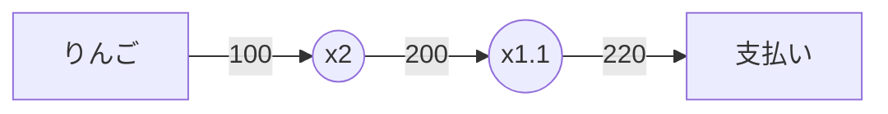

変数を分けて考えると以下のように書き換えられる。

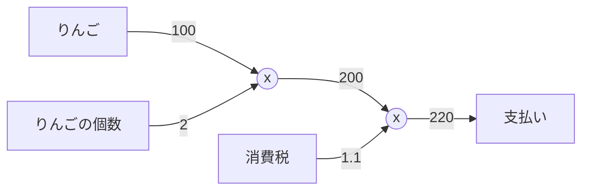

このようにすることで複雑な計算があったとしても局所的な計算部分だけ記にすれば良くなり、都合が良い。

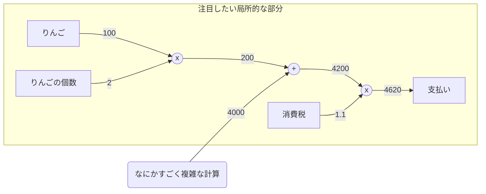

この計算グラフの利点は、計算の途中結果をすべて保持(表現)できる点にある。途中結果が保持されることで逆伝播により「微分」を効率よく表現できる。
実際にりんごの価格に着目して逆伝播を表現してみると以下の左向きの矢印のようになる。左向き矢印の数値は支払金額を$L$、りんごの値段を$x$としたときの偏微分$\frac{\partial L}{\partial x}$に相当する。

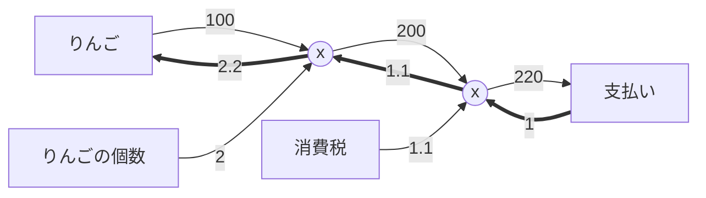

上記の意味するところは、「りんごが1円値上がりすると支払い額は2.2円増加する」ということである。


### 連鎖律

逆伝播の例を計算グラフで表してみる。$y = f(x)$の逆伝播を示す。

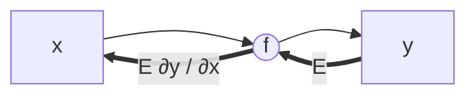

ここで、連鎖律(chain rule)とは合成関数の微分に関する次の性質のことである。

> ある関数が合成関数で表される場合、その合成関数の微分は、合成関数を構成するそれぞれの関数の微分の積によって表すことができる。

これを説明するために以下のような合成関数を考える。

$$
\begin{aligned}
z &= t^2 \\
t &= x + y
\end{aligned}
$$

このとき、$\frac{\partial z}{\partial x}$は以下のように表すことができる。

$$
\frac{\partial z}{\partial x} = \frac{\partial z}{\partial t} \frac{\partial t}{\partial x}
$$

ここで、局所的な微分を求める。

$$
\begin{aligned}
\frac{\partial z}{\partial t} &= 2t \\
\frac{\partial t}{\partial x} &= 1
\end{aligned}
$$

ということで連鎖律で求めた$\frac{\partial z}{\partial x}$は以下のように計算できる。

$$
\frac{\partial z}{\partial x}
= \frac{\partial z}{\partial t} \frac{\partial t}{\partial x}
= 2t \cdot 1
= 2(x+y)
$$

これを計算グラフで表すと以下のようになる。

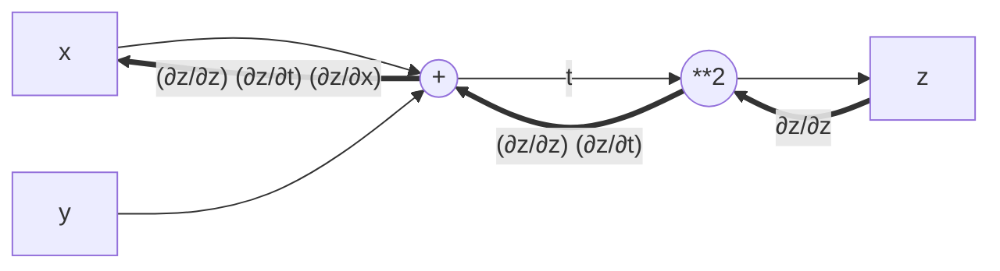

これにより、以下のように計算する事ができる。(局所化した上で微分を逆伝播することができる)

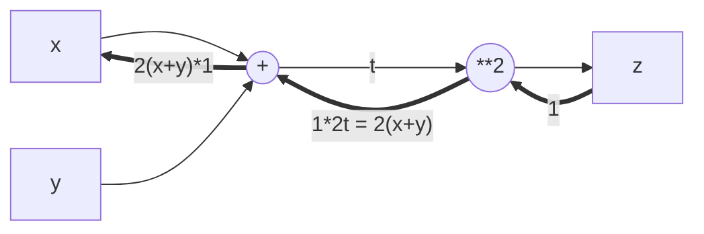

この手法を利用して加算や乗算のレイヤ(層)を構成することができる。

### 活性化関数レイヤ


